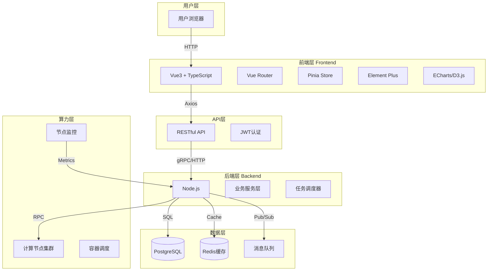
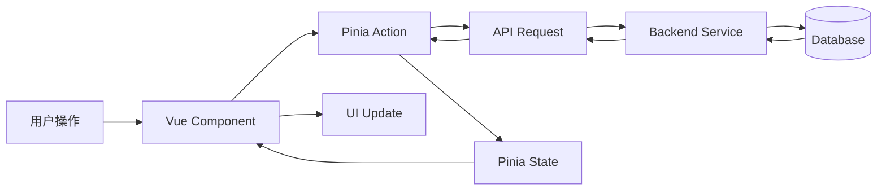

# 超算互联网 - 算力数据可视化大屏

## 系统架构图



## 前端组件架构

```
frontend/
├── src/
│   ├── components/          # 公共组件
│   │   ├── StatsCard.vue   # 统计卡片
│   │   ├── ChartLine.vue   # 折线图
│   │   ├── ChartPie.vue    # 饼图
│   │   └── DataTable.vue   # 数据表格
│   │
│   ├── views/               # 页面视图
│   │   ├── Dashboard.vue   # 数据大屏（首页）
│   │   ├── Nodes.vue       # 节点管理
│   │   ├── Tasks.vue       # 任务管理
│   │   └── Analytics.vue   # 性能分析
│   │
│   ├── stores/              # Pinia状态管理
│   │   ├── dashboard.ts    # 大屏数据
│   │   ├── nodes.ts        # 节点状态
│   │   └── tasks.ts        # 任务列表
│   │
│   ├── api/                 # API接口
│   │   ├── dashboard.ts    # 大屏接口
│   │   ├── nodes.ts        # 节点接口
│   │   └── tasks.ts        # 任务接口
│   │
│   ├── utils/               # 工具函数
│   │   ├── format.ts       # 格式化
│   │   ├── chart.ts        # 图表配置
│   │   └── request.ts      # 请求封装
│   │
│   ├── App.vue              # 根组件
│   └── main.ts              # 入口文件
│
├── public/                  # 静态资源
├── docs/                    # 项目文档
└── package.json
```

## 数据流架构



## 技术栈选型

| 层级 | 技术 | 版本 | 说明 |
|:---|:---|:---:|:---|
| 框架 | Vue3 | ^3.4.x | 组合式API |
| 语言 | TypeScript | ^5.x | 类型安全 |
| 构建 | Vite | ^5.x | 快速开发 |
| 路由 | Vue Router | ^4.x | SPA路由 |
| 状态 | Pinia | ^2.x | 状态管理 |
| UI库 | Element Plus | ^2.x | 组件库 |
| 图表 | ECharts | ^5.x | 数据可视化 |
| 3D | Three.js | ^0.16x | 3D可视化 |
| HTTP | Axios | ^1.x | 网络请求 |
| 工具 | Lodash | ^4.x | 工具函数 |

## 开发规范

### Git工作流（E0017教训后制定）

1. **项目初始化时必须检查 .gitignore**
   ```bash
   cat .gitignore | grep -E "(node_modules|dist|build)"
   ```

2. **添加前预览（限制输出行数）**
   ```bash
   git status --short | head -50
   ```

3. **明确指定文件，禁止 `git add .`**
   ```bash
   git add src/ docs/ README.md
   ```

4. **禁止使用的危险命令**
   - `git reset --hard` 🔴
   - `git clean -fd` 🔴
   - `rm -rf` 🔴

5. **代码备份策略**
   - 本地：工作区 + Git
   - 远程：GitHub
   - 重要节点必须 `git push`

### 命名规范

- 组件：PascalCase（StatsCard.vue）
- 文件：camelCase（dashboard.ts）
- 常量：UPPER_SNAKE_CASE
- 接口：I前缀（IUser, IDashboard）

### 代码规范

- 使用 `<script setup lang="ts">`
- 组件 Props 必须定义类型
- 使用 Composition API
- 异步操作使用 async/await

---
*创建时间：2026-04-06*
*版本：v1.0.0 - 重建版*
